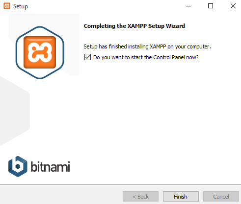

# Instalasi Webserver

Mengapa harus menggunakan webserver ?

Sebuah bahasa kode hanya dipahami oleh sebuah interpreter atau penerjemah. Artinya, jika anda menuliskan kode PHP maka kode tersebut hanya bisa dipahami oleh interpreter PHP. Oleh interpreter PHP,  kode tersebut akan diterjemahkan menjadi bahasa yang bisa dipahami oleh manusia. Hasil interpreter ini sebenarnya sudah dapat dilihat hasilnya melalui sebuah jendela konsol. Namun, tentu hanya dapat dilihat pada komputer yang menjalankan jendela konsol interpreter saja. 

Bagaimana jika hasilnya ingin dilihat dari mana saja? 

Disinilah fungsi utama dari sebuah webserver. Hasil terjemahan dari interpreter akan disajikan dalam sebuah browser seperti Chrome atau Firefox. Dan selanjutnya setiap kali sebuah laman diakses, maka hasilnya dapat dilihat oleh siapapun yang mengakses ke webserver tersebut.

XAMPP merupakan kumpulan aplikasi yang memiliki beragam fungsi, yang disatukan agar pengguna lebih mudah dalam menjalankan sebuah website. Setidaknya ada 3 aplikasi utama yang wajib digunakan agar sebuah website dapat berjalan degan baik, yaitu Apache Web Server, PHP dan Database Server \(biasanya menggunakan MySQL\). 

Secara lengkap, XAMPP terdiri dari :

* Apache
* MySQL
* PHP
* PHPMyAdmin
* FileZilla FTP Server
* Tomcat
* XAMPP Control Panel

Cara menginstall XAMPP ini dapat dilakukan dengan cara berikut :

* Unduh File XAMPP. Berkas XAMPP dapat diunduh pada laman **apachefriends.org**.  Tunggu hingga proses unduh selesai.
* Setelah selesai, jalankan instalasi dengan meng-klik 2 kali pada ikon tersebut, hingga muncul jendela seperti gambar berikut :

* Klik pada tombol Next untuk melanjutkan proses instalasi.
* Pada jendela berikut ini, silahkan aplikasi yang ingin dipasang. Pilihan standarnya adalah semua aplikasi telah dipilih.

* Lanjutkan dengan mengklik pada tombol Next.
* Pada jendela selanjutnya akan muncul pemilihan lokasi instalasi, secara standar akan terisi C:\xampp.

* Lanjutkan dengan mengklik pada tombol Next. Tunggu hingga proses instalasi selesai. 

* Jika proses telah selesai, akan muncul jendela seperti gambar berikut :

* Lanjutkan dengan mengklik pada tombol Finish. Tunggu hingga XAMPP akan dijalankan untuk pertama kalinya. 
* Pada pilihan Bahasa, silahkan pilih bahasa yang anda pahami, lalu klik tombol Save.
* Setelah itu akan muncul jendela pengelolaan XAMPP

* Silahkan klik tombol **Start** pada module Apache dan MySQL saja. Sedangkan module lain bisa anda abaikan. Tunggu hingga tombol berubah menjadi **Stop** yang berarti server telah berjalan dengan baik.

Untuk mengetahui apakah server telah berjalan, silahkan buka browser Chrome atau Firefox, lalu ketik pada kolom alamat dengan isian http://localhost atau http://127.0.0.1 dan tekan tombol Enter.

Selanjutnya silahkan buka Windows Explorer anda untuk dan arahkan pada folder   
 C:\xampp. Isi dari folder tersebut terdiri dari beberapa folder, namun yang akan banyak digunakan adalah folder **/htdocs**, dimana semua aplikasi berbasis web akan disimpan didalam folder tersebut.

Misalkan anda membuat folder /latihan didalam folder /htdocs maka ketika dijalankan pada browser, alamat pemanggilannya menjadi http://localhost/latihan. 

Misalkan jika didalam folder /latihan anda membuat file misalkan base.html maka di browser akan dijalankan dengan alamat http://localhost/latihan/base.html

Sampai tahap ini, webserver telah siap. 

