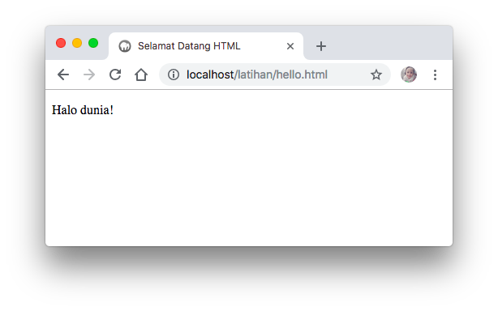

# Pengenalan HTML

**HTML** diperkenalkan pertama kali oleh Tim Berners-Lee, seorang ahli fisika dan dan juga seorang kontraktor di CERN \(Organisasi Eropa untuk Riset Nuklir\)  pada tahun 1980. Ide awal dari pengembangan HTML ini adalah bagaimana ilmuwan di CERN dapat berbagi dokumen. Sembilan tahun kemudian,  Tim Berners-Lee mulai mengembangkan perangkat lunak jaringan beserta standar penulisan markah HTML. 

**HTML** , singkatan dari Hypertext Markup Language, adalah sebuah bahasa markah yang digunakan untuk membuat sebuah halaman web, menampilkan berbagai informasi di dalam sebuah penjelajah web Internet dan pemformatan hiperteks sederhana. Ditulis dalam berkas format ASCII agar dapat menghasilkan tampilan wujud yang terintegerasi. Dengan kata lain, berkas yang dibuat dalam perangkat lunak pengolah kata dan disimpan dalam format ASCII normal sehingga menjadi halaman web dengan perintah-perintah HTML.

Format dasar penulisan tag HTML adalah sebagai berikut :

```
<tag_pembuka> ... </tag_penutup>
```

Hampir semua tag HTML akan menggunakan pola diatas, kecuali pada beberapa tag yang tidak berpasangan, seperti **&lt;br&gt;** untuk _break_ \(pindah baris\) atau **&lt;hr&gt;** untuk _horizontal line_ \(garis horizontal\). 

Tag ini dikenal juga dengan sebutan _self-closing tag_ atau _void tag_, untuk penulisannya bisa ditulis dengan **&lt;br&gt;,** maupun **&lt;br /&gt;.** 

**HTML tidak case-sensitif**, yang artinya dalam artian penulisan **&lt;p&gt;** dianggap sama dengan **&lt;P&gt;**. Dalam **HTML** pun**,** spasi akan diabaikan.

Berikut ini adalah contoh struktur sederhana HTML


```markup
<!DOCTYPE HTML>
<html>
    <head>
        <title>Selamat Datang HTML</title>
    </head>
    <body>
        <p>Halo dunia!</p>
    </body>
</html>
```


Silahkan ketik kode diatas, simpan pada folder c:/xampp/htdocs/latihan/hello.html dan jalankan pada browser dengan alamat http://localhost/latihan/hello.html



Selamat, anda telah berhasil membuat laman website pertama anda.

