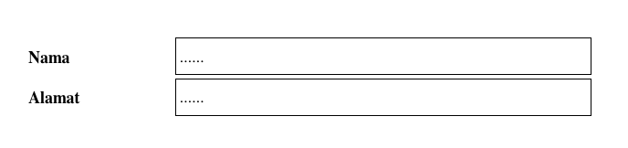
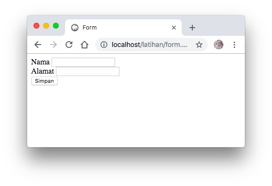

# Membuat Form

Sebuah form biasanya digunakan untuk mengirim masukkan dinamis yang bisa ditangkap oleh interpreter lain misalnya PHP. 

Ilustrasinya semisal ada sebuah form isian untuk pendaftaran anggota. Ada 2 kolom isian yang akan diisi oleh calon anggota, yaitu kolom Nama dan Alamat. Selanjutnya, setelah isian telah diisi, maka data akan diproses atau disimpan.



Dengan menggunakan sebuah form, kolom isian tersebut dapat dibuat dengan kode sebagai berikut :



```markup
<!DOCTYPE html>
<html lang="en">
<head>
    <title>Form</title>
</head>
<body>
    <form action="form.html" method="get">
        Nama <input type="text" name="nama">
        <br>
        Alamat <input type="text" name="alamat">
        <br>
        <button>Simpan</button>
    </form>    
</body>
</html>
```



Hasilnya adalah sebagai berikut :



Sampai tahap ini, form tersebut belum bisa mengolah data. Misalkan anda mengetikkan isi pada kolom Nama dan Alamat. Ketika tombol Simpan diklik, maka halaman tersebut menjadi kosong kembali. Hal ini dikarenakan belum ada fungsi dari HTML yang bisa mengolah data input ini ke dalam sebuah database. Oleh karena itu, HTML harus dikombinasikan dengan PHP.   

