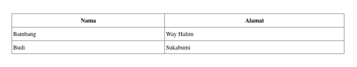
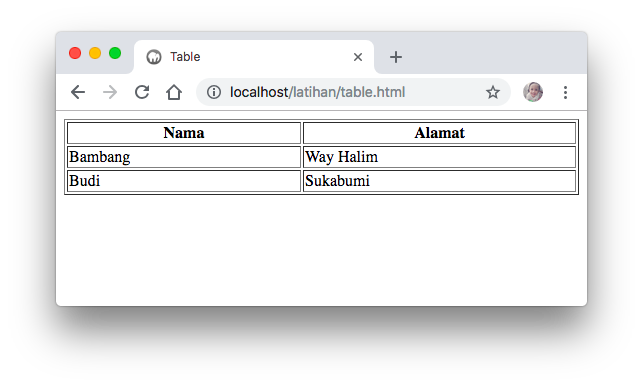

# Membuat Table

Table dapat diartikan sebagai sebuah bagan yang terdiri dari kolom dan baris. Pada masing-masing lanjur baris dapat diisikan keterangan atau informasi yang akan disajikan dalam bentuk teks atau gambar, yag dikelompokkan berdasarkan kolom yang saling bersesuaian.

Sebagai contoh, berikut ini adalah tampilan dari sebuah tabel yang berisikan informasi data anggota, dimana ada kolom yaitu Nama dan Alamat.  

Dengan menggunakan HTML, table diatas dapat dihasilkan dengan kode sebagai berikut :


<!DOCTYPE html>
<html lang="en">
<head>
    <title>Table</title>
</head>
<body>
    <table border="1" width="35%">
        <thead>
            <tr>
                <th>Nama</th>
                <th>Alamat</th>
            </tr>
        </thead>
        <tbody>
            <tr>
                <td>Bambang</td>
                <td>Way Halim</td>
            </tr>
            <tr>
                <td>Budi</td>
                <td>Sukabumi</td>
            </tr>
        </tbody>
    </table>
</body>
</html>


Adakalanya penulisan **thead** dan **tbody** tidak dituliskan. Hal ini tidak akan mengurangi hasil dari table yang kita inginkan.


<table border="1" width="35%">
    <tr>
        <th>Nama</th>
        <th>Alamat</th>
    </tr>
    <tr>
        <td>Bambang</td>
        <td>Way Halim</td>
    </tr>
    <tr>
        <td>Budi</td>
        <td>Sukabumi</td>
    </tr>
</table>


Walaupun mungkin hasil yang diharapkan sedikit berbeda dari sisi tampilan, tetapi secara fungsi sudah sesuai. 

